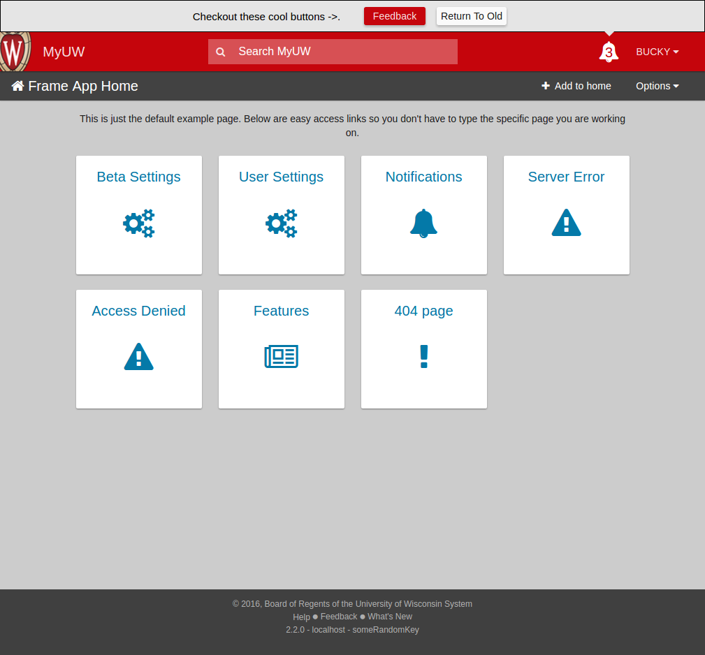

# uPortal-app-framework

Questions? [Get in touch][uportal-user@].

<!-- current project status -->
[](https://badge.fury.io/js/uw-frame)
[](https://maven-badges.herokuapp.com/maven-central/edu.wisc.my.apps/uw-frame)
[](https://travis-ci.org/UW-Madison-DoIT/uw-frame)
[](https://coveralls.io/github/UW-Madison-DoIT/uw-frame?branch=master)
[](https://david-dm.org/UW-Madison-DoIT/uw-frame)
[](https://david-dm.org/UW-Madison-DoIT/uw-frame?type=dev)
[](https://dependencyci.com/github/UW-Madison-DoIT/uw-frame)
[](https://www.bithound.io/github/UW-Madison-DoIT/uw-frame)
[](https://greenkeeper.io/)
[](http://issuestats.com/github/uw-madison-doit/uw-frame)
[](http://issuestats.com/github/uw-madison-doit/uw-frame)
[](https://app.fossa.io/projects/git%2Bgithub.com%2FUW-Madison-DoIT%2Fuw-frame?ref=badge_shield)

<!-- standards used in project -->
[](http://semver.org/spec/v2.0.0.html)
[](http://keepachangelog.com/en/1.0.0/)
[](https://conventionalcommits.org)
[](http://commitizen.github.io/cz-cli/)
[](https://google.github.io/styleguide/)

<!-- incubation status -->
[](http://uw-madison-doit.github.io/angularjs-portal/apereo-incubation.html)
[![Apereo Incubating badge](https://img.shields.io/badge/apereo-incubating-blue.svg?logo=data%3Aimage%2Fpng%3Bbase64%2CiVBORw0KGgoAAAANSUhEUgAAAA4AAAAOCAYAAAAfSC3RAAAABmJLR0QA%2FwD%2FAP%2BgvaeTAAAACXBIWXMAAAsTAAALEwEAmpwYAAAAB3RJTUUH4QUTEi0ybN9p9wAAAiVJREFUKM9lkstLlGEUxn%2Fv%2B31joou0GTFKyswkKrrYdaEQ4cZAy4VQUS2iqH%2BrdUSNYmK0EM3IkjaChnmZKR0dHS0vpN%2FMe97TIqfMDpzN4XkeDg8%2Fw45R1XNAu%2Fe%2BGTgAqLX2KzAQRVGytLR0jN2jqo9FZFRVvfded66KehH5oKr3dpueiMiK915FRBeXcjo9k9K5zLz%2B3Nz8EyAqX51zdwGMqp738NSonlxf36Cn7zX9b4eYX8gSBAE1Bw9wpLaW%2BL5KWluukYjH31tr71vv%2FU0LJ5xzdL3q5dmLJK7gON5wjEQizsTkFMmeXkbHxtHfD14WkbYQaFZVMzk1zfDHERrPnqGz4wZ1tYfJ5%2FPMLOYYW16ltrqKRDyOMcYATXa7PRayixSc4%2FKFRhrqjxKGIWVlZVQkqpg1pYyvR%2BTFF2s5FFprVVXBAAqq%2F7a9uPKd1NomeTX4HXfrvZ8D2F9dTSwWMjwywueJLxQKBdLfZunue0Mqt8qPyMHf0HRorR0ArtbX1Zkrly7yPNnN1EyafZUVZLJZxjNLlHc%2BIlOxly0RyktC770fDIGX3vuOMAxOt19vJQxD%2BgeHmE6liMVKuNPawlZ9DWu2hG8bW1Tuib0LgqCrCMBDEckWAVjKLetMOq2ZhQV1zulGVFAnohv5wrSq3tpNzwMR%2BSQi%2FyEnIl5Ehpxzt4t6s9McRdGpIChpM8Y3ATXbkKdEZDAIgqQxZrKo%2FQUk5F9Xr20TrQAAAABJRU5ErkJggg%3D%3D)](https://www.apereo.org/content/projects-currently-incubation)

`uPortal-app-framework` is a front-end framework for building web applications that users experience as "apps in the portal".

This package includes the `uPortal-home` header, settings, footer, and some reusable components :



Learn more about the reusable components on our [docs page](http://uw-madison-doit.github.io/uw-frame/)

`uPortal-app-framework` is somewhere in the process of renaming from its old `uw-frame` name.

## Requirements

* [node](https://nodejs.org/en/)
* [npm](https://www.npmjs.com/)

### Java (only if you want a maven artifact)
* [Maven](http://maven.apache.org)
* JDK 7

## Quickstart

uw-frame provides the primary HTML page at the root of the context that hosts your AngularJS single page application. In order to introduce your own content, uw-frame's extension point is 'my-app/main.js'.

### Getting Started with uw-frame

In your existing Maven war project, add the following dependency:

```xml
<dependency>
  <groupId>edu.wisc.my.apps</groupId>
  <artifactId>uw-frame</artifactId>
  <version>x.y.z</version>
  <type>war</type>
</dependency>
```

(uw-frame is [available in The Central Repository](http://search.maven.org/#search%7Cgav%7C1%7Cg%3A%22edu.wisc.my.apps%22%20AND%20a%3A%22uw-frame%22).)

Start by creating the folder 'src/main/webapp/my-app' within your Maven war project, and copy [uw-frame's main.js](uw-frame-components/my-app/main.js) in to it.
uw-frame includes [RequireJS](http://requirejs.org/) to help you load any additional JavaScript assets you wish, you'll do that in this file.

See [my-app-seed](https://github.com/UW-Madison-DoIT/my-app-seed) for a great starter app using this frame.

### Getting Started with uw-frame-static

This gives you the basic frame in a static content type way. Just add your files to the proper directory and you should be all set. This module is still a work in progress. Note it only works right now as the root context (if you want to change, update the index.html). This module is mostly used for development on the frame itself.

### Testing

We love tests. We setup karma to run our tests.

To run the test suite:

```sh
npm test
```

### Running locally

To build and run on a Superstatic server:

```sh
npm run static:dev
```

### Maven

You can also create a artifact using maven.  There's a pom.xml file in the
root directory.  The maven build will use the normal npm build and
bundle into a deliverable war file.

## Running the documentation

To run the Jekyll docs locally:

```sh
cd docs

bundle exec jekyll serve
```

You may need to install the Jekyll bundler on your machine. See [Jekyll's quick-start guide](https://jekyllrb.com/docs/quickstart/) for instructions.

[uportal-user@]: https://groups.google.com/a/apereo.org/forum/#!forum/uportal-user


## License
[](https://app.fossa.io/projects/git%2Bgithub.com%2FUW-Madison-DoIT%2Fuw-frame?ref=badge_large)