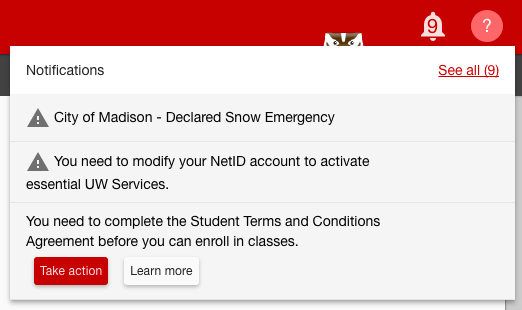

Within-portal announcements draw attention to new content.

MyUW [documents how it uses announcements](https://kb.wisc.edu/myuw/page.php?id=63903) in its Knowledge Base.

### Theme

A mascot in the header can make announcements.

The `mascotImg` variable in [the theme](theming.md) sets the theme-specific mascot.

If `mascotImg` is unset, `uw-frame` defaults to a generic robot mascot.

### Creating a mascot image
The image itself should have the following characteristics:

<ul style="list-style-type:upper-alpha!important">
<li style="padding:4px 0">Height of always-visible portion: 16px from top</li>
<li style="padding:4px 0">Eye height: 12px from top, so that you can see them during the hidden state.</li>
<li style="padding:4px 0">Full height : 40px</li>
<li style="padding:4px 0">Full width : 60px</li>
<li style="padding:4px 0">Transparent background</li>
</ul>
*Note*: Your mascot image can be an animated gif, but animations should be limited to blinking eyes.

### States

#### No new announcements

When there are no new announcements the mascot is completely hidden.

#### Initial state
When there is at least one new announcement, the mascot will appear in the top bar but will be mostly hidden:

#### Hover state
This state is triggered when someone mouses over the hidden mascot. It slides up a little bit and shows a tooltip instructing
the user to click to see more:

#### Clicked state

If the mascot is clicked while in hidden/hover state, it will slide up and the announcements will become visible:

If clicked again while in this state, the mascot will slide back down to the initial state. If all the announcements are dismissed, the mascot will disappear.
