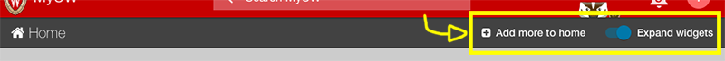

# App options

Apps using the `<app-header>` or `<frame-page>` [directives](directives.md) can specify custom app-specific options to appear in the app header, as pictured below.



## Notes & best practices

Read the following notes before you implement custom app options.

**1. There is limited space for your app options to appear:**

+ On screens wider than 600px (gt-xs), app-options can occupy 50% of the app header
+ On screens smaller than 600px (xs), app-options can occupy **only 15%** of the app header (this is to accommodate apps with longer names)

For this reason, we strongly suggest leveraging Angular Material's [md-menu directive](https://material.angularjs.org/latest/demo/menu) to group related options inside of an icon menu.
At minimum, you should do this on "xs" screen sizes.

**2. Create responsive options templates**

Use Angular Material's [show-xs, hide-xs, etc. directives](https://material.angularjs.org/latest/layout/options) to craft responsive app options.

**3. Space will be further limited if show-add-to-home is "true"**

You can read about this attribute in the [directives doc](directives.md). Be mindful of the extra space the button occupies. On "xs" screens, it appears as an icon button with a tooltip. On larger screens,
it's a regular `md-button` that says "Add to home".

## Implementation

Custom app options can be implemented in two simple steps.

### 1. Create an HTML template for your options menu

See the example code below:

```html
<!-- portal/misc/partials/example-options.html -->
<md-menu>
  <md-button aria-label="Open options menu" class="md-primary link-div" ng-click="$mdOpenMenu($event)">
    <span layout="row" layout-align="center center"><md-icon>settings</md-icon></span>
  </md-button>
  <md-menu-content width="4">
    <md-menu-item>
      <md-button class="md-default" href="http://uportal-project.github.io/uportal-app-framework/directives.html">See Documentation</md-button>
    </md-menu-item>
    <md-menu-item>
      <md-button class="md-default" href="https://github.com/uPortal-Project/uportal-app-framework"><span><i class="fa fa-github"></i> Checkout Repo</span></md-button>
    </md-menu-item>
  </md-menu-content>
</md-menu>
```

In this case, we've opted to include a settings menu with the gear icon on all screen sizes. This menu takes up very little space while still conveying meaning to users.

*Note: This markup is just an example. A real settings menu should include ways to adjust/view settings.*

### 2. Configure the path to the template

Add the following to [override.js](https://github.com/uPortal-Project/uportal-app-framework/blob/master/components/js/override.js):

```js
define(['angular'], function(angular) {
  return angular.module('override', [])
    .constant('OVERRIDE', {
      // Custom configuration after this line
      'APP_OPTIONS': {
        'optionsTemplateURL': 'path/to/your/template.html'
      }
      // Custom configuration before this line
    });
});
```

*Notes:*

+ *The path is evaluated in AppHeaderOptionsController (portal/misc/controllers.js)*
+ *The path must lead to a file in your project directory (for now). In a perfect world, this controller would be more robust
and would accept a service to retrieve template HTML from a provided endpoint. Go to [uportal-app-framework on GitHub](https://github.com/uPortal-Project/uportal-app-framework) to open
an issue or pull request to make this happen!*
