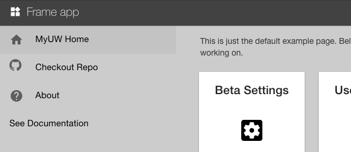

# Main Menu

When developing an app with uPortal-app-framework, you can use the configurable side navigation for in-app navigation and app-wide functionality.
The main menu is opened by the hamburger icon in the top left corner of the app. On medium and large screens, the menu includes only the content you've
configured. On mobile, the menu includes a top bar with portal-wide components like the notifications bell, username menu, and new features button.

If you don't configure the menu, the hamburger icon and side navigation will not be displayed, and the portal-wide content will be displayed in the top bar on small screens.

Basic configuration occurs in your app's `override.js` file. See the [configuration doc](configuration.md) for an example.

**Important:** Side navigation depends on the `<frame-page>` directive. Use the `<frame-page>` directive as the outermost containing element for your app view(s). See the [frame-page.html](https://github.com/uPortal-Project/uportal-app-framework/blob/master/components/portal/misc/partials/frame-page.html) file to understand how this is constructed.

## How to use

There are two levels of complexity you can use when configuring the contents of your menu.

1. [Simple](#simple-configuration): Menu options that have a text label, a url, and an optional material icon (i.e. basic links)
2. [Custom template](#custom-menu-template): Varied menu options, some of which may be tied to an angular controller and affect functionality of the app (e.g. a theme-switching toggle)

You can also try the _**experimental**_ [push-content feature](#push-content-navigation) if you want the side navigation to be open upon page load and appear as part of the page content. The side nav will push content when it is opened and give up the space when closed.

## Simple configuration

In your `override.js` file, add an array of menu item objects to the **appMenuItems** attribute using the format in the following example.

```js
.constant('OVERRIDE', {
  'APP_OPTIONS': {
    'appMenuItems': [
      {
        'label': 'MyUW home',
        'icon': 'home',
        'url': '/web',
      },
    ],
  },
});
```

#### Explanation of attributes

- **appMenuItems**: An array of menu item objects. This is where the app will look to fill in the menu items.
- **label**: The text displayed for this menu item.
- **icon**: *(optional)* An material icon to enhance the appearance and context of the menu item. See [material icons](https://material.io/icons/) to see the icons available.
- **url**: The value that should be in the `href` attribute for this menu item.

The app will first check to see if you're using the complex configuration. If not, it will look for this simple configuration.

## Custom menu template

1. Create an HTML template for the menu items somewhere in your project
2. Add the path to that template as the value to the **appMenuTemplateURL** key in your `override.js` file
3. Hook up your custom `ng-controller` or whatever other functionality you want out of the menu

Example `override.js` file:

```js
.constant('OVERRIDE', {
  'APP_OPTIONS': {
    'appMenuTemplateURL': '/your-app/menu/menu-items.html'
  },
});
```

#### Best practices

The HTML from your template will be injected into a `<md-menu-content>` element from the AngularJS Material library. Therefore, you should follow the [AngularJS material guidelines](https://material.angularjs.org/latest/demo/menu) for constructing an md-menu.
Specifically, the hierarchy of menu items in your custom template should look like this:

```html
<md-menu-item>
  <md-button>
    <!-- button text -->
  </md-button>
</md-menu-item>
```

This will ensure that your menu items look great and perform consistently.

Additionally, each of your buttons should call `vm.closeMainMenu()` on click (in addition to anything else you want those buttons to do on click). This function looks to the parent controller within uPortal-app-framework and closes the menu when the item is clicked.
This means that any angular controller you connect to your menu items should not use `vm` if using angular's `controllerAs` syntax.

Alternatively, you can access the `closeMainMenu()` function in your custom controller by calling `$scope.$parent.closeMainMenu()`.

This is the easiest way to configure your menu to ensure it looks and behaves in a way that is consistent with other frame apps.
You're free to add custom content with custom CSS in whatever form you like, with the caveat that your choices may not be supported by future improvements to this framework.

**Full example menu template:**

```html
<div ng-controller="MyCustomController as customCtrl">
  <md-menu-item ng-repeat="item in customCtrl.menuItems">
    <md-button ng-href="{{ item.url }}" ng-click="item.onClick();vm.closeMainMenu();">
      {{ item.buttonText }}
    </md-button>
  </md-menu-item>
</div>
```

## Push content navigation

[](img/push-content-nav.png)

1. In your `override.js` file, set **APP_OPTIONS.enablePushContent** to true
2. Use the `<frame-page>` directive as the outermost containing element for your app view(s). See the [frame-page.html](https://github.com/uPortal-Project/uportal-app-framework/blob/master/components/portal/misc/partials/frame-page.html) file to understand how this is constructed.
3. Be aware that the content within your `<frame-page>` is a child of flex-positioned HTML elements. You may need to write custom CSS to ensure this performs the way you want.
4. Be aware that this is an experimental feature. If you encounter difficulty using this feature, feel free to open a new issue on the [uportal-app-framework project](https://github.com/uPortal-Project/uportal-app-framework/issues)

Example `override.js` file:

```js
.constant('OVERRIDE', {
  'APP_OPTIONS': {
    'appMenuTemplateURL': '/your-app/menu/menu-items.html'
    'enablePushContent': true
  },
});
```
