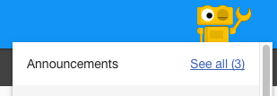
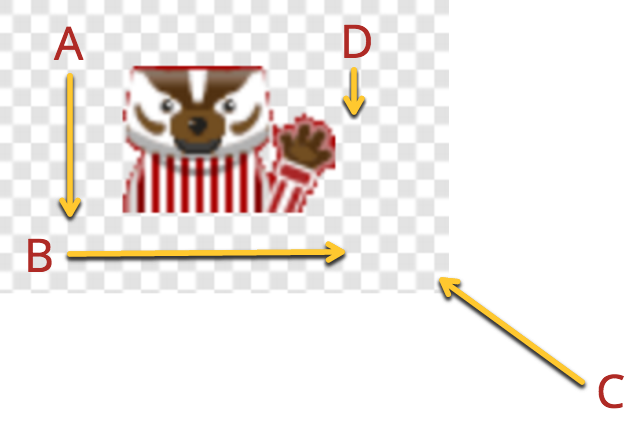

# In-app messaging (technical implementation)

Notifications and Announcements (notifications, mascot announcements, popup announcements, etc.) share a single data model. They depend on a
JSON feed containing certain attributes and flags. See the [configuraton](configuration.md) doc for information about how to
point uportal-app-framework to your desired feed.

Widget messaging is based on JSON input configured in a [widget's configuration](make-a-widget.md).

## Example message

*Note: All messages must be contained within the "messages" array.*

```json
{
    "messages": [
        {
            "id": "sample-unactivated-services-notification",
            "title": "You need to modify your NetID account to activate essential UW Services.",
            "titleShort": null,
            "description": "Because this message's messageType is 'notification', this field is not actually needed.",
            "descriptionShort": null,
            "messageType": "notification",
            "goLiveDate": "2017-08-01T09:30",
            "expireDate": "2017-08-02",
            "featureImageUrl": null,
            "priority": "high",
            "recurrence": true,
            "dismissible": false,
            "audienceFilter": {
                "groups": ["Users - Service Activation Required"],
                "dataUrl": "/restProxyURL/unactivatedServices",
                "dataObject": "services",
                "dataArrayFilter": {"priority":"essential", "type":"netid"}
            },
            "actionButton": {
                "label": "Activate services",
                "url": "my.wisc.edu/go/example/path"
            },
            "moreInfoButton": null,
            "confirmButton": null
        }
    ]
}
```

**Attribute breakdown**

- **id**: A unique string to identify the message. This is used for tracking seen/unseen messages, dimissed notifications, and the sort order on the notifications page.
- **title**: The text to be displayed as the message's main content -- used in all message types. **Best practices:**
  - Be concise! Try to limit your message's title to ~140 characters. Shorter titles improve click-through and are less likely to cause display issues on smaller screens.
  - Use general language and avoid pronouns for broadly visible messages that may not pertain to specific users' needs (ex. "City of Madison - Declared Snow Emergency").
  - Use the word "You" when the group- or data-filtering for a message is somewhat specific (i.e. Users with unactivated accounts).
- **titleShort**: A shorter version of the message title used by the mascot announcer menu. *Required if the `messageType` is "announcement".*
- **description**: Information about an announcement -- appears on the "Features" page and in the popup announcement.
- **descriptionShort**: Brief information about an announcement -- appears in the mascot announcer menu. *Required if the `messageType` is "announcement".*
- **messageType**: Accepts either "notification" or "announcement" -- used to distinguish between the two broader categories.
- **goLiveDate**: *(optional)* Accepts a simple ISO date, including time (as pictured). This is used to restrict displaying a message to a certain day/time.
- **expireDate**: *(optional)* Accepts a simple ISO date, including time (as pictured). This is used to stop displaying a message at a certain day/time.
- **featureImageUrl**: *(optional)* Used by popup announcements and announcements on the Features page.
- **priority**: Set to "high" if you want the message to be displayed with higher visibility (i.e. As a priority notification or popup announcement, respectively).
- **recurrence**:*(experimental, optional)* If true, even if a notification is dismissed, it will continue to reoccur in the user's home at the start of every session until the user is no longer a member of the targeted group. For example, if a user is a member of students-with-outstanding-parking-tickets, that user will be confronted with the notification at every login until they pay the fine.
- **dismissible**: *(experimental, optional)* Set to false if you want to disallow users from dismissing a notification. This should only be used for truly critical messages. If the attribute is set to true or not set at all, the notification will be dismissible.
- **audienceFilter**: A group of attributes related to filtering messages based on a user's group or whether the user has pertinent data at a given URL.
  - **groups**: An attribute to optionally show messages only to specific groups (i.e. uPortal groups). If null or empty array, the message will be shown to everyone. Contact your portal development team for more information about group filtering.
  - **dataUrl**: *(optional)* The message will retrieve data from the dataUrl. If data exists, it will show this message to the user. Only supports JSON.
    You would use this feature if you want to only show the message if the specific user has data. For example: Only show user if they have a certain document.
  - **dataObject**: *(optional)* Will only be looked at if `dataUrl` is present, otherwise ignored. Used as an optional further refinement from dataUrl, if you want the notification to show only if the specific object is in the data.
  - **dataArrayFIlter**: Will only be looked at if `dataUrl` is present, otherwise ignored. Used as an optional further refinement from dataUrl. If your object return is an array, you can filter on the array. Does support multiple filtering criteria as shown in the example. If used in conjunction with `dataObject`, will filter to `dataObject` first.  [AngularJS array filtering documentation] (https://docs.angularjs.org/api/ng/filter/filter)
- **actionButton**: Used to display a call to action button and to provide the URL for a notification when clicked. **Required if the `messageType` is "notification".
  - **label**: The button's text
  - **url**: The URL to go to when clicked
    - **addToHome** For an "Add To Home" action button, where the user is asked to add a widget to their home layout, the url is formatted: "addToHome/{fName}", where fName = the fname of the widget.
- **moreInfoButton**: Used to display a button link to a place where the user can read more, see more, or interact with the subject of the message. Uses the same format as `actionButton`.
- **confirmButton**: Used to display a confirmation button on popup announcements. Uses the same format as `actionButton`. **Required for `messageType` "announcement" with `priority` "high".**

## Configuring the mascot announcer

The `mascotImg` variable in [the theme](theming.md) sets the theme-specific mascot. If `mascotImg` is unset, it defaults to a generic robot mascot.



### Creating a mascot image

The image itself should have the following characteristics:



+ A. Height of always-visible portion: 16px from top
+ B. Eye height: 12px from top, so that you can see them during the hidden state.
+ C. Full height : 40px
+ D. Full width : 60px
+ E. Transparent background

*Note: The mascot image can be an animated gif, but animations should be limited to e.g. blinking eyes to achieve subtle presence without excessive distraction.*

## Configuring a widget message

Configuration is done by two required items and one optional.  Required is a url
where to find a JSON object and an array representing where in the object the
message can be found.  Optional is an array representing where in the object the
learn more url can be found.
The url to find the JSON object can be both external and internal to the app's
configuration.

Example JSON object
```json
{
  "status": "Success",
  "result": [
    {
      "message": "This is an important message that includes an optional learn more link for more information."
    }
  ],
 "learnMoreUrl": "https://apereo.org"
}
```

Example widget configuration
```xml
<portlet-preference>
    <name>widgetExternalMessageUrl</name>
    <value>locationToFindJSONObject</value>
</portlet-preference>
<portlet-preference>
    <name>widgetExtneralMessageTextObjectLocation</name>
    <value>["result", 0, "message"]</value>
</portlet-preference>
<portlet-preference>
    <name>widgetURL</name>
    <value>["learnMoreUrl"]</value>
</portlet-preference>

```


## Exercises

### Notifications

Follow these steps to create a notification.

1. Add a JSON message to
[components/staticFeeds/sample-messages.json](https://github.com/uPortal-Project/uportal-app-framework/blob/master/components/staticFeeds/sample-messages.json)
2. [Start frame](quickstart.md)
3. Try changing some of the options like making the priority "high".

You can use this example JSON:

```json
{
    "id": "sample-notification-uportal-app-framework-docs",
    "title": "Learn how to create a notification",
    "titleShort": null,
    "description": null,
    "descriptionShort": null,
    "messageType": "notification",
    "goLiveDate": null,
    "expireDate": null,
    "featureImageUrl": null,
    "priority": null,
    "audienceFilter": {
        "groups": [],
        "dataUrl": null,
        "dataObject": null,
        "dataArrayFilter": null
    },
    "actionButton": {
        "label": "Take action",
        "url": "http://uportal-project.github.io/uportal-app-framework/messaging-implementation.html"
    },
    "moreInfoButton": null,
    "confirmButton": null
}
```

### Announcements

Try adding this announcement to the sample feed:

```json
{
    "id": "sample-announcement-uportal-app-framework-docs",
    "title": "My first feature announcement",
    "titleShort": "First announcement",
    "description": null,
    "descriptionShort": "A trial of uPortal-Home's features",
    "messageType": "announcement",
    "goLiveDate": "2017-08-01T09:30",
    "expireDate": "2017-08-02",
    "featureImageUrl": null,
    "priority": null,
    "audienceFilter": {
        "groups": null,
        "dataUrl": null,
        "dataObject": null,
        "dataArrayFilter": null
    },
    "actionButton": null,
    "moreInfoButton": {
        "label": "Learn more",
        "url": "http://uportal-project.github.io/uportal-app-framework/messaging-implementation.html"
    },
    "confirmButton": null
}
```

Try some of the following things:

- Give it "high" priority and a confirm button
- Adjust the live/expire dates
- Give it a feature image url
