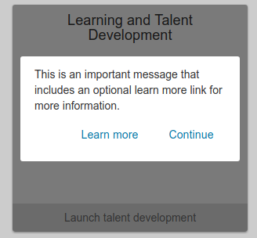

# Messages (notifications)

This application framework offers messages (notifications) to users.

## Notifications

Notifications are messages about **you** (i.e. the user).

cf.

+ [MyUW Notifications Overview][]
+ [MyUW Notifications Guidelines][]

### Notification bell

On medium and large screens, a bell icon button appears in the application's top
bar. If the user has unseen notifications, the bell displays a number and shows
a preview window when clicked. Clicking the
"See all" link brings users to the notifications page for a more detailed view.

On small screens, a small bell icon without a count appears on top of the mobile
menu button.

### Mobile menu link

In addition to the bell icon, the mobile menu contains a link to the
notifications page that also displays the number of unseen notifications.

### Priority notifications

For critical notifications that require a higher degree of visibility,
notifications can be designated as "high priority" and will appear more
prominently, fixed above the
application top bar. In cases when the user has more than one priority
notification to view, a generic message will be displayed, featuring the
priority notifications
count and a link to the notifications page.

### Nofitications page

On the notifications page, users can view, follow calls to action on, and
dismiss their notifications. They can also click the "Dismissed" tab to view
notifications they've previously dismissed. High priority notifications
float to the top of the lists.

## Announcements

Announcementes are messages about the app or about things that pertain to
everyone. They're for telling users about things like new app features.
MyUW [documents how it uses announcements](https://kb.wisc.edu/myuw/page.php?id=63903) in its Knowledge Base.

Announcements are discoverable in two ways: The mascot announcer and popup
modals.
See the [technical implementation doc](messaging-implementation.md) to see how
to create a mascot image and how to write both types of announcements.

### Mascot announcer

When enabled and when the user has unseen announcements, a mascot appears in the
top bar.

When hovered, the mascot slides up a little and shows a tooltip inviting the
user to click to see more. The tooltip also displays the number of unseen
announcements to view.

When clicked, it displays a preview window with the latest announcements.
Clicking the "See all" link
brings the user to the Features page, where there's a more detailed view of all
announcements.

### Popup modal

Announcements that are designated "high priority" will appear in the mascot
announcer's menu, but will also be displayed in the form of a modal upon loading
the app. Users can dismiss the modal
by clicking elsewhere on the screen or clicking a configurable "confirm" button.

## Widget messaging

Widget messaging can be used to give the user a message in a way that interrupts
a user's interaction with a widget.  A dialog appears over the widget allowing
the user to continue after reading the message.  An optional `Learn more` button
 is an opportunity to link to a learn more page.

[MyUW Notifications Overview]: https://kb.wisc.edu/myuw/71187
[MyUW Notifications Guidelines]: https://docs.google.com/document/d/1xa3t5gibaSgYGtGBKeIt0EGMC9XSMaOwVlgJtMCZ-Vg/edit
