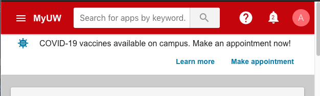

# Messages (notifications)

This application framework offers messages (notifications) to users.

## Notifications

Notifications are messages about **you** (i.e. the user).

Preferably these are *actionable* and the user can resolve them and thereby
make them go away. They're conceptually a "to do list" of important stuff to
take action upon.

The idea is that a user might be accessing MyUW for purpose A,
notice a notification, thereby become aware of task B,
and click into the notification to take action to complete B.

cf.

+ [MyUW Notifications Overview][]
+ [MyUW Notifications Guidelines][]

### Notification bell

On medium and large screens, the top app bar shows a bell icon button. If the
user has unseen notifications, the bell displays a number and shows a preview
window when clicked. "See all" links to the notifications page for a detailed
view.

On small screens, the mobile menu button shows a small bell icon without a
count.

### Mobile menu link

In addition to the bell icon, the mobile menu contains a link to the
notifications page that also displays the number of unseen notifications.

### Priority notifications (DEPRECATED)

DEPRECATED. Critical notifications designated "high priority" will appear more
prominently, fixed above the application top bar. When the user has more than
one priority notification, the framework displays a generic message featuring
the priority notifications count and a link to the notifications page.

### Notifications page

On the notifications page, users can view, follow calls to action on, and
dismiss their notifications. They can also click the "Dismissed" tab to view
notifications they've previously dismissed. High priority notifications
(DEPRECATED) float to the top of the lists.

## Banner messages

Separately from the bell notifications, the framework supports banner messages.

Banner messages have message text, an optional icon, and an optional single
action button.

## Widget messaging

Widget messaging can interrupt a user's interaction with a widget. The user can
continue to use the widget after dismissing the dialog that appears
appears over the widget. Optionally a `Learn more` button can link to a learn
more page.

[MyUW Notifications Overview]: https://kb.wisc.edu/myuw/71187
[MyUW Notifications Guidelines]: https://docs.google.com/document/d/1xa3t5gibaSgYGtGBKeIt0EGMC9XSMaOwVlgJtMCZ-Vg/edit
